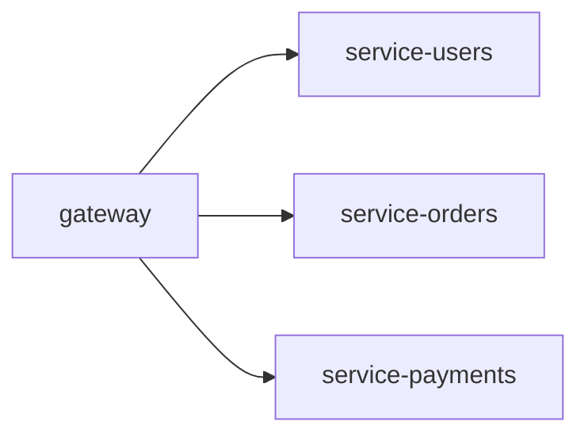
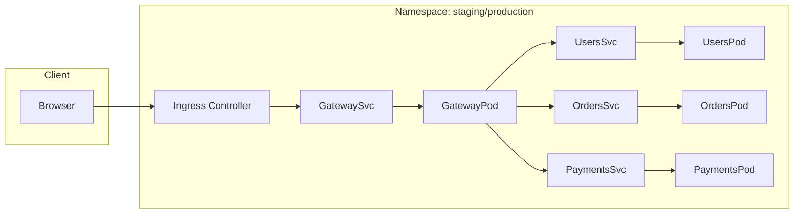

# Microservices Infrastructure & CI/CD Platform (Kubernetes, GitHub Actions, Helm, Docker)


A production-ready **DevOps platform** for a microservices system running on **Kubernetes**, with full CI/CD, security scanning, containerization, and environment separation.  
Built using **GitHub Actions**, **Helm**, **Docker**, **Node.js**, and **GitHub Container Registry (GHCR)**.

This repository demonstrates real-world skills required for modern DevOps workflows.

---

# 🚀 Features

### **🔹 Microservices Architecture**
- gateway  
- service-users  
- service-orders  
- service-payments  
All services expose `/health` endpoints and run independently.

### **🔹 CI Pipeline (GitHub Actions)**
- matrix testing per service  
- linting + unit tests  
- Docker build  
- image push to GHCR  
- security scanning with **Trivy**

### **🔹 CD Pipeline**
- Auto-deploy to **staging** on `develop`
- Versioned deploy to **production** on `vX.Y.Z` tags
- Helm-based deployments with:
  - readiness/liveness probes  
  - safe rollbacks (`--atomic`)  
  - post-deploy smoke tests  

### **🔹 Kubernetes via Helm**
- Separate namespaces: `staging`, `production`
- Deployment, Service, optional Ingress
- Configurable ports, replicas, env variables

### **🔹 Local Development**
- `docker-compose.yml`
- All services run locally with one command

### **🔹 Infrastructure as Code**
- Terraform directory reserved for provisioning clusters (optional)

---

# 🧩 Architecture

## Microservices Overview



---

## CI/CD Pipeline

```mermaid
flowchart TD
    A[Developer Push] --> B[CI: Lint & Tests]
    B --> C[Build Docker Images]
    C --> D[Push to GHCR]
    D --> E[Security Scan (Trivy)]

    E --> F[Staging CD<br>Push to develop]
    F -->|helm upgrade| G[Staging Namespace]
    G --> H[Smoke Tests]

    H --> I[Tag vX.Y.Z → Production CD]
    I -->|helm upgrade --atomic| J[Production Namespace]
    J --> K[Post-deploy Tests]
```

---

## Kubernetes Deployment Architecture



---

# 📁 Repository Structure

```text
.
├── app/
│   ├── gateway/
│   ├── service-users/
│   ├── service-orders/
│   └── service-payments/
├── deploy/
│   └── helm/
│       └── app/
│           ├── Chart.yaml
│           ├── values.yaml
│           └── templates/
├── scripts/
│   ├── smoke-tests-staging.sh
│   └── smoke-tests-prod.sh
├── infra/
│   └── terraform/
├── docker-compose.yml
└── .github/
    └── workflows/
        ├── ci.yml
        ├── cd-staging.yml
        └── cd-prod.yml
```

---

# 🛠 Local Development

Install Docker, then run:

```bash
docker compose up --build
```

Services:

| Service | Port |
|--------|------|
| gateway | 3000 |
| service-users | 3001 |
| service-orders | 3002 |
| service-payments | 3003 |

Health check example:

```bash
curl http://localhost:3000/health
```

---

# 🔄 CI/CD Pipelines

## CI (ci.yml)
- Runs on `main`, `develop`, and PRs
- Matrix testing for each service
- Docker build + push
- Trivy vulnerability scan

## CD (cd-staging.yml / cd-prod.yml)
- Deploy to **staging** on every push to `develop`
- Deploy to **prod** on tags `vX.Y.Z`
- Helm chart deployment with full configuration

---

# ☸ Helm Deployment

Base values: `deploy/helm/app/values.yaml`

Key settings:

```yaml
global:
  image:
    registry: ghcr.io
    prefix: arsenzh/microservices-infrastructure-cicd
    tag: "latest"
```

Ingress example:

```yaml
ingress:
  enabled: true
  className: nginx
  host: app.example.com
  tls: false
```

---

# 📌 Summary

This repository demonstrates:

- microservices architecture  
- professional CI/CD setup  
- container orchestration  
- Kubernetes infrastructure  
- Helm packaging  
- automated security scanning  
- environment separation  
- real-world DevOps workflows  

---

# 📬 Contact

GitHub: https://github.com/arsenzh
